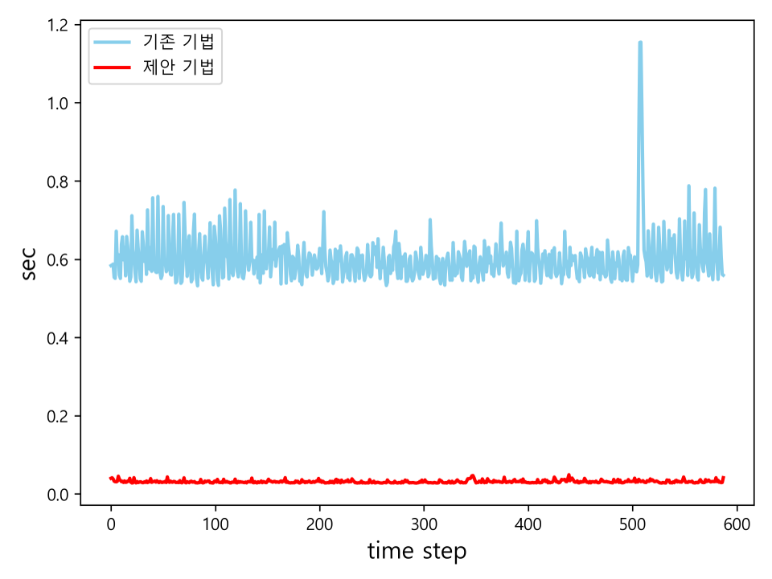
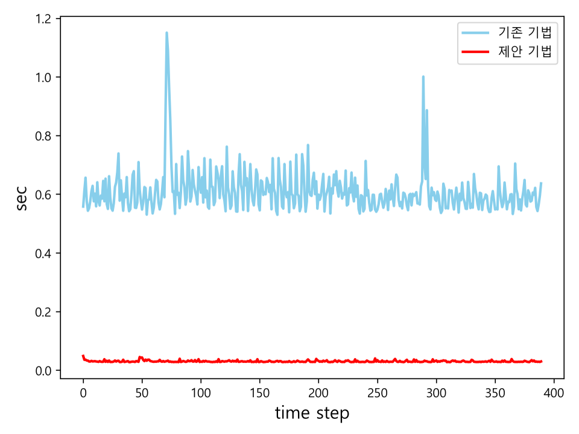

# U-Net을 이용한 무인항공기 비정상 비행 탐지 기법 연구  

**논문 정보**  
- **저널:** 항공우주시스템학회지 (JASE)  
- **발행년도:** 2024, Vol.18, No.3, pp.41-47  
- **저자:** 송명재, 최은주, 김병수, 문용호  
- 🔗[논문 원문 링크](https://koreascience.or.kr/article/JAKO202419757614446.page)  

## 1. 연구 개요  
무인항공기의 실용화 및 상업화가 확대됨에 따라 **비행 안전성 확보에 대한 관심**이 증가하고 있다.  
무인항공기 사고는 재산 피해뿐만 아니라 인명 피해를 초래할 가능성이 크므로 **비정상 비행을 사전에 탐지하고 예방할 수 있는 기술이 필수적**이다.  

기존 연구에서는 **AutoEncoder 기반 비정상 비행 탐지 모델**이 개발되었으나,  
- **성능 한계** (탐지 지연 발생)  
- 온보드 환경(Onboard Environment)에서의 **실시간 처리 한계** (모델 복잡도 높음)  

등의 문제점이 존재했다.  

본 연구에서는 **U-Net 기반 비정상 비행 탐지 기법**을 제안하고, **모의실험 및 실험 환경을 통해 탐지 성능을 검증**하였다.

## 2. 기존 비정상 비행 탐지 기법  

### **2.1 기존 AutoEncoder 기반 기법의 한계**  
기존 연구에서는 **AutoEncoder 모델을 활용하여 비정상 비행 탐지를 수행**하였다.  

**탐지 방식:**  
1. **정상 비행 데이터로 모델 학습**  
2. **실제 비행 데이터 입력 → 재구성 오차 계산**  
3. **마할라노비스 거리**를 활용하여 비정상 상태 판별  

**한계점:**  
- AutoEncoder 모델의 **복잡도 증가 → 실시간 탐지 어려움**  
- **탐지 지연 발생 → 사고 예방에 부적절**  
- **마할라노비스 거리의 최대값을 임계값으로 설정** → 일부 상황에서 탐지 실패 가능성 존재  

## 3. 제안하는 U-Net 기반 비정상 비행 탐지 기법  

### **3.1 U-Net 모델 활용 이유**  
AutoEncoder 모델의 **복잡도를 낮추고 탐지 성능을 개선하기 위해** U-Net 모델을 활용하였다.  

**U-Net의 특징:**  
- AutoEncoder 구조를 기반으로 **Skip Connection 추가**  
- **정보 손실을 최소화하여 재구성 정확도 향상**  
- **CNN 기반으로 처리 속도 향상 → 실시간 탐지 가능**  

### **3.2 U-Net 모델 구조**

기존 AutoEncoder 기반 모델과 비교하여 **복잡도를 줄이고, 연산 속도를 개선**하였다.

- **기존 AutoEncoder 모델:**  
  - Multi-layer Bi-LSTM 포함 (계산량 많음)  
  - 탐지 지연 발생  
- **제안하는 U-Net 모델:**  
  - CNN 기반 Skip Connection 활용  
  - **빠른 재구성 & 높은 정확도 유지**  

---

### **3.3 비정상 비행 탐지 방식**  
기존 기법은 **마할라노비스 거리의 최대값**을 기준으로 탐지하였다. 하지만 **마할라노비스 거리의 증가량**을 분석한 결과, **정상 비행 상태에서 벗어나는 시점을 더 조기에 탐지할 수 있음**을 확인하였다. 이에 본 연구에서는 **마할라노비스 거리 증가량을 활용한 탐지 기법**을 제안하였다.

1. **비행 데이터 입력 → U-Net을 통한 재구성 오류 계산**  
   - 정상 비행만 학습한 U-Net 모델을 사용하여 재구성 오류(`E(t)`)를 계산  

2. **마할라노비스 거리 `d(t)` 계산**  
   - `E(t)`를 기반으로 **정상 비행 데이터와의 통계적 차이**를 나타내는 마할라노비스 거리(`d(t)`)를 계산  

3. **이동 평균(Moving Average) 적용하여 `c(t)` 생성**  
   - **단기 노이즈를 제거하고 탐지 안정성을 높이기 위해** `d(t)`에 이동 평균을 적용  

4. **`c(t)`의 변화량(`Δc(t)`)이 임계값(`Th`)을 초과하면 비정상 탐지**  
   - 비정상 비행 진입 시점에서 `c(t)`가 급격히 증가하면 **비정상 상태로 판별**  

## 4. 실험 및 결과  

### 4.1 실험 데이터 및 환경  

#### **비행 데이터 조건**
- **비행 속도 변화** (15~21m/s)  
- **비행 경로 변경** (Pitch, Roll 포함)  
- **정상 및 비정상 비행 데이터 생성** 
- **총 학습 데이터:** 61,010개  
- **검증 데이터:** 15,291개  

| Case | Initial Speed (m/s) | Command Speed (m/s) | Pitch (deg) | Flight Condition |
|------|------------------|------------------|------------|----------------|
| UL-1 | 21 | 15 | -45 ~ +45 | Normal |
| UL-2 | 21 | 10 | -45 ~ +45 | Abnormal |
| UL-3 | 21 | 5  | -45 ~ +45 | Abnormal |
| UL-4 | 18 | 15 | -45 ~ +45 | Normal |

#### 하드웨어 및 학습 환경  
| CPU | GPU | RAM | OS |
|-----|-----|-----|----|
| Intel i5-3570 @ 3.40 GHz | Nvidia GTX 970 | 16GB | Windows 10 Pro |

| Optimizer | Loss Function | Learning Rate | Batch Size | Max Epoch |
|-----------|--------------|--------------|-----------|----------|
| Adam | MAE | 0.00008 | 16 | 500 |

### 4.2 탐지 성능 비교
#### **탐지 지연 시간 비교**
제안한 **U-Net 모델**은 기존 **AutoEncoder 기법 대비 평균 3.6 Time Step 탐지 오차가 감소**하였으며, 이를 통해 **정상 비행 상태를 벗어나는 시점을 더욱 정밀하게 탐지할 수 있다.**

| initV | cmdV | cmdPhi | Existing Technique Error (Time Step) | Proposed Technique Error (Time Step) |
|-------|------|--------|------------------------------|------------------------------|
| 15    |  5   |  -45   |  4  |  4  |
|       |      |  -30   |  5  |  3  |
|       |      |  -16   |  16 |  3  |
|       |      |  -15   |  15 |  3  |
|       |      |    0   |  19 |  6  |
|       |      |   15   |  16 |  4  |
|       |      |   30   |  5  |  3  |
|       |      |   45   |  6  |  4  |
|       |  10  |  -45   |  -  |  27  |
|       |      |  -30   |  14 |  4  |
|       |      |  -16   |  21 |  15 |
|       |      |  -15   |  28 |  21 |
|       |      |    0   |  28 |  21 |
|       |      |   15   |  25 |  15 |
|       |      |   30   |  69 |  59 |
|       |      |   45   |  0  |  0  |
| 18    |  5   |  -45   |  6  |  3  |
|       |      |  -30   |  6  |  3  |
|       |      |  -16   |  5  |  3  |
|       |      |  -15   |  4  |  2  |
|       |      |    0   |  5  |  3  |
|       |      |   15   |  5  |  3  |
|       |      |   30   |  7  |  4  |
|       |      |   45   |  6  |  3  |
|       |  10  |  -45   |  7  |  4  |
|       |      |  -30   |  13 |  5  |
|       |      |  -16   |  6  |  4  |
|       |      |  -15   |  6  |  3  |
|       |      |    0   |  7  |  4  |
|       |      |   15   |  7  |  4  |
|       |      |   30   |  13 |  5  |
|       |      |   45   |  7  |  4  |
| 21    |  5   |  -45   |  6  |  3  |
|       |      |  -30   |  5  |  5  |
|       |      |  -16   |  2  |  1  |
|       |      |  -15   |  11 |  7  |
|       |      |    0   |  2  |  1  |
|       |      |   15   |  2  |  1  |
|       |      |   30   |  5  |  5  |
|       |      |   45   |  6  |  3  |
|       |  10  |  -45   |  7  |  2  |
|       |      |  -30   |  5  |  4  |
|       |      |  -16   |  3  |  1  |
|       |      |  -15   |  27 |  20 |
|       |      |    0   |  3  |  1  |
|       |      |   15   |  3  |  1  |
|       |      |   30   |  5  |  4  |
|       |      |   45   |  7  |  2  |
| **Average** |  |  | **10.19** | **6.59** |

### 4.3 실시간 탐지 성능 검증
#### 모델 연산 복잡도 비교

|Model|	Parameters|	FLOPs|
|----------|-------------|------------|
|AutoEncoder|	5,596,899|	83,948,640|
|U-Net|	213,075|	3,184,800|

- AutoEncoder 대비 95% 연산량 감소 → 실시간 탐지 가능

#### 온보드 환경에서 모델의 데이터 처리 실행 시간 비교

|환경|	기존 기법 (평균:s)|	제안 기법 (평균:s)|
|----------|-------------|------------|
|PC|	0.3179|	0.0129|
|온보드 (Jetson TX2)|	0.601|	0.031|

|||
|--|--|
|Example1|Example2|

제안 기법은 **Jetson TX2 환경**에서 **평균 0.031초 내에 탐지를 완료**하며, 이는 **30Hz의 실시간 탐지 성능을 충족함**을 의미한다.

## 5. 결론  

- **U-Net 기반 비정상 비행 탐지 기법을 제안**  
- **기존 AutoEncoder 기반 기법 대비 탐지 성능 개선**  
- **연산 복잡도 감소로 실시간 탐지 가능성 확인**  
- **온보드 환경에서도 실시간 탐지 성능 입증 (30Hz 처리 가능)**  

